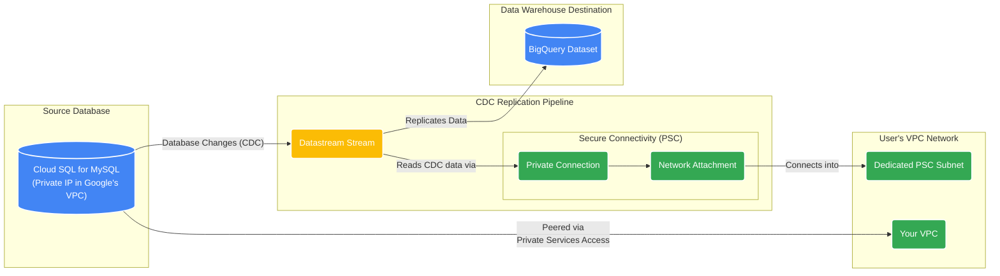

# GCP Datastream and Cloud SQL for MySQL using Private Service Connect (PSC)

This Terraform project provisions a complete end-to-end solution for capturing Change Data Capture (CDC) data from a Cloud SQL for MySQL instance and replicating it to BigQuery. The entire connection is established securely and privately using **Private Service Connect (PSC)**.

The infrastructure is deployed in **two distinct stages** to separate network setup from application resources, which is a best practice for managing infrastructure lifecycles.

## Overall Architecture Diagram



## Architecture

### Stage 1: Network (`terraform/01-network`)

This stage builds the foundational network infrastructure.

1.  **VPC & Subnets**: A new VPC is created in custom mode, with public and private subnets in each availability zone of the specified region.
2.  **Cloud NAT & Router**: A Cloud Router and NAT gateway are configured to allow instances in the private subnets to access the internet for outbound traffic (e.g., for system updates).
3.  **Firewall Rules**: Basic firewall rules are created to allow internal traffic, SSH, and ICMP.
4.  **Service Networking**: A VPC Peering connection is established with Google's services network to enable private access for Cloud SQL.
5.  **PSC Subnet**: A dedicated subnet is created specifically for Private Service Connect, which Datastream will use.

### Stage 2: Application Infrastructure (`terraform/02-app-infra`)

This stage deploys the application-specific resources on top of the network foundation.

1.  **Cloud SQL for MySQL**: A new MySQL 8.0 instance is provisioned with a private IP address. It is configured as a service producer for PSC.
2.  **BigQuery Dataset**: A destination dataset is created in BigQuery to store the replicated data.
3.  **Datastream**:
    *   A **Network Attachment** is created for PSC connectivity.
    *   A **Datastream Private Connection** uses the attachment to connect to the VPC.
    *   Source (MySQL) and Destination (BigQuery) **Connection Profiles** are created.
    *   A **Datastream Stream** is configured to capture changes from the MySQL source and deliver them to the BigQuery destination.

## Prerequisites

*   **Terraform**: `v1.5.7` or later
*   **Google Cloud SDK**: Authenticated to your GCP account (`gcloud auth application-default login`).
*   **Enabled APIs**: Before starting, ensure the required APIs are enabled. You can run the `gcloud` command provided in the [FAQ](ifaq.md) or let Terraform enable them automatically by running `terraform apply` in each stage.

## How to Use

Deployment is a two-stage process. You must deploy the network first, followed by the application infrastructure.

### Stage 1: Deploy the Network

1.  **Navigate to the network directory:**
    ```bash
    cd terraform/01-network
    ```

2.  **Create `terraform.tfvars`**:
    Copy the example file and provide the required values.
    ```bash
    cp terraform.tfvars.example terraform.tfvars
    ```
    Edit `terraform.tfvars` and set your `project_id` and a unique `psc_subnet_cidr_range`.

3.  **Initialize and Apply**:
    ```bash
    terraform init
    terraform plan
    terraform apply
    ```
    When prompted, type `yes` to confirm the deployment.

### Stage 2: Deploy the Application Infrastructure

1.  **Navigate to the app-infra directory:**
    ```bash
    cd ../02-app-infra
    ```

2.  **Create `terraform.tfvars`**:
    Copy the example file and provide the required values.
    ```bash
    cp terraform.tfvars.example terraform.tfvars
    ```
    Edit `terraform.tfvars` and set your `project_id` and the `allowed_psc_projects`. Your own project ID must be in this list.

3.  **Initialize and Apply**:
    ```bash
    terraform init
    terraform plan
    terraform apply
    ```
    This will deploy Cloud SQL, BigQuery, and Datastream, referencing the network created in Stage 1.

## Post-Deployment

After deployment, you must complete two manual steps: granting permissions to the Datastream user and starting the replication stream.

### 1. Grant SQL Permissions

You need to connect to the newly created Cloud SQL instance and grant the necessary permissions to the `datastream` user.

#### a. Get the Admin Password

You can retrieve the generated admin password from the Terraform output. First, navigate to the `terraform/02-app-infra` directory and run the following command:
```bash
terraform output admin_user_password
```

#### b. Connect to the Database via Cloud SQL Studio

Cloud SQL Studio provides a SQL workbench directly in the GCP Console.

1.  Open the [Cloud SQL instances page](https://console.cloud.google.com/sql/instances) in the GCP Console.
2.  Find your newly created instance (e.g., `mysql-src-ds`) and click on its name to open the details page.
3.  From the left navigation menu, select **"Cloud SQL Studio"**.
4.  In the login panel, enter the username `admin` and the password you retrieved in the previous step. The database name is `testdb`.
5.  Click **Log in** to open the query editor.

#### c. Execute the GRANT Command

In the Cloud SQL Studio query editor, run the following SQL commands to grant the required permissions for CDC replication.
```sql
GRANT REPLICATION SLAVE, SELECT, REPLICATION CLIENT ON *.* TO 'datastream'@'%';
FLUSH PRIVILEGES;
```

### 2. Start the Stream

The Datastream stream is created in a `NOT_STARTED` state. You must manually start it via the GCP Console or the `gcloud` command.

For example, if your stream is named `mysql-to-bigquery-stream` and is in the `us-central1` region, run the following command:

```bash
gcloud datastream streams update mysql-to-bigquery-stream \
    --location=us-central1 \
    --state=RUNNING
```

## Testing the Pipeline with Fake Data

After the infrastructure is deployed and the Datastream stream is running, you can generate and insert sample data into the Cloud SQL instance to verify that the CDC pipeline is working correctly.

1.  **Navigate to the scripts directory**:
    ```bash
    cd ../../scripts 
    # (If you are in terraform/02-app-infra)
    ```

2.  **Setup the Python environment**:
    Follow the instructions in `scripts/README.md` to set up the `uv` virtual environment and install dependencies.

3.  **Generate SQL statements**:
    Use the script to generate both DDL (for table creation) and DML (for data insertion) and save them to a file.
    ```bash
    uv run python generate_fake_sql.py --generate-ddl --max-count 1000 > sample_data.sql
    ```

4.  **Connect to the Cloud SQL instance via Cloud SQL Studio**:

    Cloud SQL Studio provides a SQL workbench directly in the GCP Console.

    a. Open the [Cloud SQL instances page](https://console.cloud.google.com/sql/instances) in the GCP Console.<br/>
    b. Find your newly created instance (e.g., `mysql-src-ds`) and click on its name to open the details page.<br/>
    c. From the left navigation menu, select **"Cloud SQL Studio"**.<br/>
    d. In the login panel, enter the username `admin` and the password (which you will retrieve in the next step). The database name is `testdb`.<br/>
    e. Click **Log in** to open the query editor.<br/>

5.  **Get the Admin Password**:

    You can retrieve the generated admin password from the Terraform output in the `02-app-infra` directory.
    ```bash
    cd ../terraform/02-app-infra
    terraform output admin_user_password
    ```

6.  **Import the SQL data**:

    Once connected to Cloud SQL Studio, you can execute the generated SQL statements.

    a. Open the `sample_data.sql` file that you generated in a local text editor and copy its entire content.<br/>
    b. Paste the content into the Cloud SQL Studio query editor.<br/>
    c. Click the **"Run"** button to execute all the `CREATE` and `INSERT` statements.<br/>

7.  **Verify in BigQuery**:
    After a few minutes (depending on Datastream's configured latency), you should see a new dataset (e.g., `datastream_destination_dataset_testdb`) and a `retail_trans` table in your BigQuery project. Query the table to confirm that the data has been replicated.

## Clean Up

To destroy all resources, you must run `terraform destroy` in the reverse order of creation.

1.  **Destroy Application Infrastructure**:
    ```bash
    cd terraform/02-app-infra
    terraform destroy
    ```

2.  **Destroy Network**:
    ```bash
    cd ../01-network
    terraform destroy
    ```
