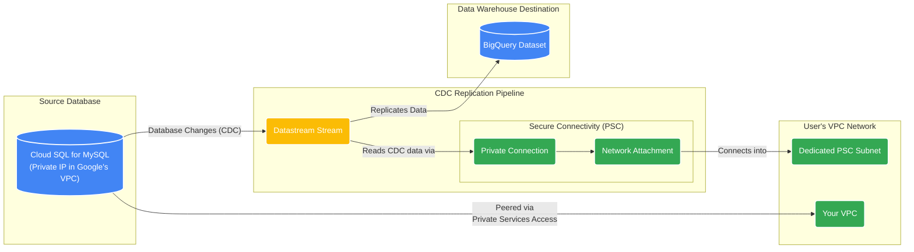

# GCP Datastream and Cloud SQL for MySQL using Private Service Connect (PSC)

This Terraform project provisions a complete end-to-end solution for capturing Change Data Capture (CDC) data from a Cloud SQL for MySQL instance and replicating it to BigQuery. The entire connection is established securely and privately using **Private Service Connect (PSC)**.

The infrastructure is deployed in **two distinct stages** to separate network setup from application resources, which is a best practice for managing infrastructure lifecycles.

## Overall Architecture Diagram



## Architecture

### Stage 1: Network (`terraform/01-network`)

This stage builds the foundational network infrastructure.

1.  **VPC & Subnets**: A new VPC is created in custom mode, with public and private subnets in each availability zone of the specified region.
2.  **Cloud NAT & Router**: A Cloud Router and NAT gateway are configured to allow instances in the private subnets to access the internet for outbound traffic (e.g., for system updates).
3.  **Firewall Rules**: Basic firewall rules are created to allow internal traffic, SSH, and ICMP.
4.  **Service Networking**: A VPC Peering connection is established with Google's services network to enable private access for Cloud SQL.
5.  **PSC Subnet**: A dedicated subnet is created specifically for Private Service Connect, which Datastream will use.

### Stage 2: Application Infrastructure (`terraform/02-app-infra`)

This stage deploys the application-specific resources on top of the network foundation.

1.  **Cloud SQL for MySQL**: A new MySQL 8.0 instance is provisioned with a private IP address. It is configured as a service producer for PSC.
2.  **BigQuery Dataset**: A destination dataset is created in BigQuery to store the replicated data.
3.  **Datastream**:
    *   A **Network Attachment** is created for PSC connectivity.
    *   A **Datastream Private Connection** uses the attachment to connect to the VPC.
    *   Source (MySQL) and Destination (BigQuery) **Connection Profiles** are created.
    *   A **Datastream Stream** is configured to capture changes from the MySQL source and deliver them to the BigQuery destination.

## Prerequisites

*   **Terraform**: `v1.5.7` or later
*   **Google Cloud SDK**: Authenticated to your GCP account (`gcloud auth application-default login`).
*   **Enabled APIs**: Before starting, ensure the required APIs are enabled. You can run the `gcloud` command provided in the [FAQ](FAQ.md) or let Terraform enable them automatically by running `terraform apply` in each stage.

## How to Use

Deployment is a two-stage process. You must deploy the network first, followed by the application infrastructure.

### Stage 1: Deploy the Network

1.  **Navigate to the network directory:**
    ```bash
    cd terraform/01-network
    ```

2.  **Create `terraform.tfvars`**:
    Copy the example file and provide the required values.
    ```bash
    cp terraform.tfvars.example terraform.tfvars
    ```
    Edit `terraform.tfvars` and set your `project_id` and a unique `psc_subnet_cidr_range`.

3.  **Initialize and Apply**:
    ```bash
    terraform init
    terraform plan
    terraform apply
    ```
    When prompted, type `yes` to confirm the deployment.

### Stage 2: Deploy the Application Infrastructure

1.  **Navigate to the app-infra directory:**
    ```bash
    cd ../02-app-infra
    ```

2.  **Create `terraform.tfvars`**:
    Copy the example file and provide the required values.
    ```bash
    cp terraform.tfvars.example terraform.tfvars
    ```
    Edit `terraform.tfvars` and set your `project_id` and the `allowed_psc_projects`. Your own project ID must be in this list.

3.  **Initialize and Apply**:
    ```bash
    terraform init
    terraform plan
    terraform apply
    ```
    This will deploy Cloud SQL, BigQuery, and Datastream, referencing the network created in Stage 1.

## Post-Deployment

After deployment, you must complete a few manual steps.

### 1. Grant SQL Permissions

You need to connect to the newly created Cloud SQL instance to grant permissions. The easiest way to perform this one-time setup is by using **Cloud SQL Studio**.

#### a. Get Admin Password

First, retrieve the generated admin password from the Terraform output. From the `terraform/02-app-infra` directory, run:
```bash
terraform output admin_user_password
```

#### b. Connect via Cloud SQL Studio

1.  Open the [Cloud SQL instances page](https://console.cloud.google.com/sql/instances) in the GCP Console.
2.  Find your instance (e.g., `mysql-src-ds`) and click its name.
3.  From the left menu, select **"Cloud SQL Studio"**.
4.  Log in with the username `admin` and the password from the previous step. The database name is `testdb`.

#### c. Execute the GRANT Command

In the Cloud SQL Studio query editor, run the following SQL commands:
```sql
GRANT REPLICATION SLAVE, SELECT, REPLICATION CLIENT ON *.* TO 'datastream'@'%';
FLUSH PRIVILEGES;
```

> **Note on Connecting from Your VPC**
> 
> For connections from your applications, scripts, or bastion hosts inside the VPC, you should use the stable **Private Service Connect (PSC) endpoint**. This provides a private, internal IP address for your Cloud SQL instance.
> 
> Get the connection details from the `terraform/02-app-infra` directory:
> ```bash
> # Use this stable internal IP for your applications
> terraform output cloud_sql_psc_endpoint_ip
> 
> # Use this password for the 'admin' user
> terraform output admin_user_password
> ```
> You would then connect using a standard MySQL client to the IP address provided by the `cloud_sql_psc_endpoint_ip` output.

### 2. Start the Stream

The Datastream stream is created in a `NOT_STARTED` state. You must manually start it. For example:
```bash
gcloud datastream streams update mysql-to-bigquery-stream \
    --location=us-central1 \
    --state=RUNNING
```


## Testing the Pipeline with Fake Data

After the infrastructure is deployed and the stream is running, you can insert sample data to verify the pipeline.

1.  **Navigate to the scripts directory**:
    ```bash
    cd ../../scripts 
    # (If you are in terraform/02-app-infra)
    ```

2.  **Setup the Python environment**:
    Follow the instructions in `scripts/README.md` to set up the `uv` virtual environment and install dependencies.

3.  **Generate SQL statements**:
    ```bash
    uv run python generate_fake_sql.py --generate-ddl --max-count 1000 > sample_data.sql
    ```

4.  **Import the SQL data via Cloud SQL Studio**:
    The simplest way to import the data is to use Cloud SQL Studio again.
    a. Connect to your database in Cloud SQL Studio as described in the "Post-Deployment" section.
    b. Open the `sample_data.sql` file in a text editor and copy its contents.
    c. Paste the SQL into the query editor and click **"Run"**.

5.  **Verify in BigQuery**:
    After a few minutes, you should see a new dataset (e.g., `datastream_destination_dataset_testdb`) and a `retail_trans` table in your BigQuery project. Query the table to confirm that the data has been replicated.

## Clean Up

To destroy all resources, you must run `terraform destroy` in the reverse order of creation.

1.  **Destroy Application Infrastructure**:
    ```bash
    cd terraform/02-app-infra
    terraform destroy
    ```

2.  **Destroy Network**:
    ```bash
    cd ../01-network
    terraform destroy
    ```
